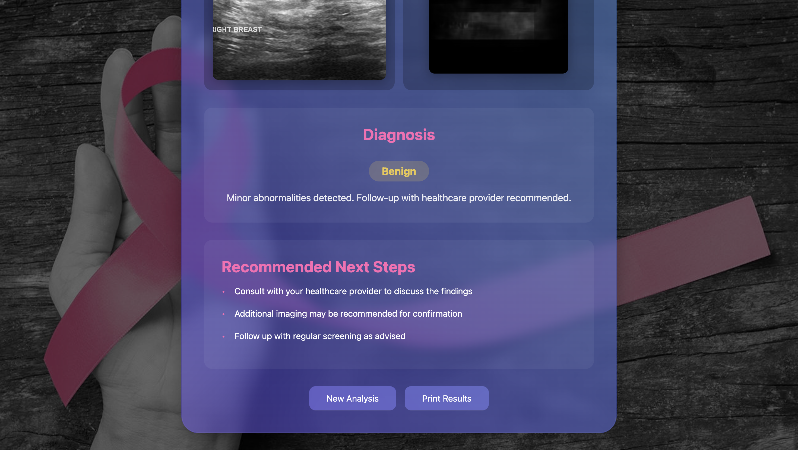

# Breast Cancer Detection App

## Overview
This Flask-based web application utilizes an **Attention U-Net** segmentation model to detect and analyze breast cancer from medical images. The model segments the region of interest in the uploaded image and provides an analysis to classify it as **Normal, Benign, or Malignant** based on intensity and segmentation characteristics.

## Features
- **Image Upload:** Users can upload medical images for analysis.
- **Segmentation Model:** Uses **Attention U-Net** for precise segmentation of affected areas.
- **Automated Analysis:** The app evaluates segmentation masks and provides a classification.
- **Results Page:** Displays the original image, segmented output, and diagnosis with a detailed explanation.
- **User-Friendly UI:** Simple navigation with a consistent theme across Home, About, and Results pages.

## Technologies Used
- **Flask** - Web framework for the backend.
- **TensorFlow/Keras** - For loading and using the segmentation model.
- **HTML, CSS, JavaScript** - For frontend design.
- **NumPy, OpenCV, TensorFlow Preprocessing** - For image processing.
- **Jinja2** - For dynamic rendering of results.

## Model Architecture
The segmentation model is built using an **Attention U-Net** architecture, which enhances focus on important regions by applying attention mechanisms during segmentation.

## Installation & Setup
### 1. Clone the repository
```sh
git clone https://github.com/yourusername/breast-cancer-detection-app.git
cd breast-cancer-detection-app
```

### 2. Create a virtual environment and install dependencies
```sh
python -m venv venv
source venv/bin/activate  # On Windows use `venv\Scripts\activate`
pip install -r requirements.txt
```

### 3. Download the Pretrained Model
- Place the **Attention_UNet_BreastCancer.h5** model file inside the `model/` directory.

### 4. Run the Flask App
```sh
python app.py
```
- The app will be available at **`http://127.0.0.1:5000/`**.

## Usage
1. **Home Page:** Upload a medical image for analysis.
2. **Segmentation:** The model processes the image and generates a segmentation mask.
3. **Results Page:** Displays:
   - The original uploaded image
   - Segmented image output
   - Diagnosis: **Normal, Benign, or Malignant**
   - Detailed analysis and recommendations.

## Screenshots  
### **Home Page**  


### **Image Upload & Segmentation**  


### **Results Page - Diagnosis**  


### **Detailed Analysis**  


### **About Page**  


## File Structure
```
📁 breast-cancer-detection-app
│── 📁 model
│   └── Attention_UNet_BreastCancer.h5  # Pretrained model
│── 📁 static
│   └── 📁 images  # Stores UI screenshots
│   └── 📁 uploads  # Stores uploaded images and results
│── 📁 templates
│   ├── index.html  # Home Page
│   ├── about.html  # About Page
│   ├── results.html  # Results Page
│── app.py  # Main Flask application
│── requirements.txt  # Python dependencies
│── README.md  # Project documentation
```

## How to Contribute  
1. Fork the repository  
2. Create a new branch (`git checkout -b feature-branch`)  
3. Make your changes and commit (`git commit -m "Added a new feature"`)  
4. Push to your branch (`git push origin feature-branch`)  
5. Open a pull request  

## Future Improvements
- Add a **heatmap visualization** for better interpretability.
- Implement **real-time predictions via an API**.
- Improve **UI with additional styling** and user instructions.

## License
This project is open-source and available under the **MIT License**.

---
**Contributions and feedback are welcome!** 🚀

